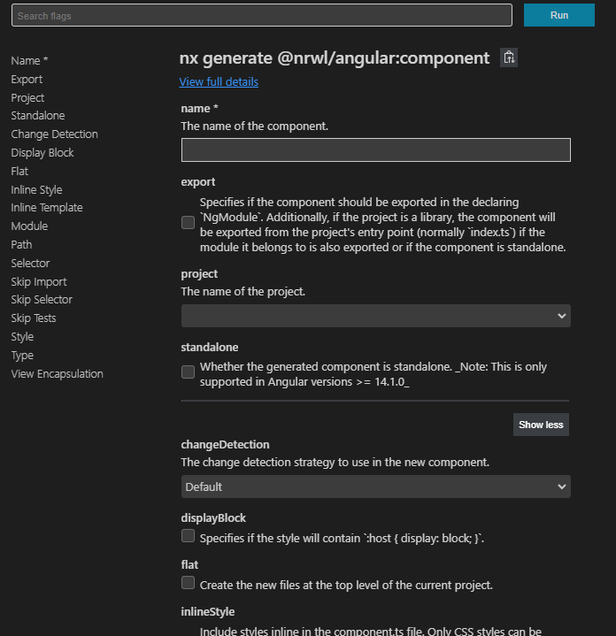

# UI Library

This library was generated with [Nx](https://nx.dev).

## Running unit tests

Run `nx test ui` to execute the unit tests.

## Description

This library would contain all the element templates used across the application styled by Tailwind and logic powered with Angular CDK

To work on this library we recommend to install [Nx Console](https://nx.dev/core-features/integrate-with-editors) extension.

Once installed, the developer can create a new component through it by clicking in the extension and selecting the generate angular component option 

Reference for [Tailwind components](https://tailwindui.com/components)  You'll need to sign in with your Relief Applications email account 
Reference for [Angular CDK APIs](https://material.angular.io/cdk/categories) There are classes and built in logic that could be useful in order to power the library's Tailwind components behavior without the need of writing the logic from scratch(modal display, dropdowns, menus etc.)

## Create a new component

First, add a module for that new component to the library with this command `nx generate @schematics/angular:module --project=ui --module=ui --name={component_name} --path=libs/ui/src/lib/{component_name} --flat` where `{component_name}` is the name of the new created component.

After that, export the created module in the `index.ts` file in the `src` folder so it can be accessible from other libraries.

Once the module it's created, open the NX Console extension and select the option shown in the imags above. The developer would see some parameters to set when creating this new component such as these: 

Please set the following param as:

- project: **ui**

And hit the Run button in the right corner of the parameters screen.

If the developer cannot use the extension, you can use the following command to create the new component: `npx nx generate @nrwl/angular:component {component_name} --project=ui --no-interactive` where `{component_name}` is the name of the new component.

==Important== :warning:

Any **enums** or **interfaces** needed for each of the components, please add them inside the component folder root under a `enums` or `interfaces` folder name for each case and export those files content adding them in the `index.ts` file of the `src` folder as well.

## Create story for component

Once the component is ready, the developer can create a story file for it in order to do all the needed testing before it's integrated in the application(s).

Open the extension and select the option shown below: 

The developer would see some parameters to set when creating this new stories, please set the following param as:

- project: **ui**

And hit the Run button in the right corner of the parameters screen.

If the developer cannot use the extension, you can use the following command to create the new component: `@nrwl/angular:stories ui --no-interactive`.

This command would generate all missing stories and keep current ones for the components inside the `lib` folder

==Important== :warning:

Nx would import some deprecated types from `@storybook` when creating the boilerplate in this way. Please review all new created `.stories.ts` with this commands to fix that and also add all the needed imports such as interfaces in those files

## Serve storybook

Run `npx nx serve ui:storybook`
